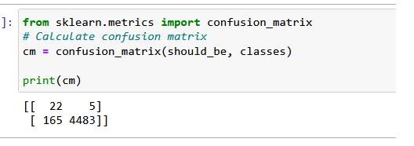
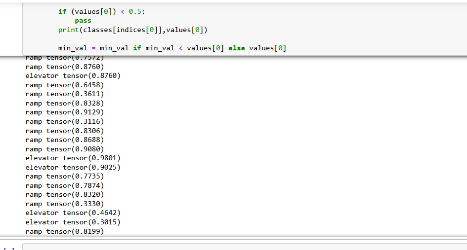

# Traditional
- 1. run `01-find-spam.py`
	- โปรแกรมนี้จะเอา folder ที่ cleaned ของเราไปเทียบกับ original dataset หลังจากนั้นจะเอา iamge ที่มีบน original แต่ไม่มีบน cleaned ไปใส่ folder spam ให้อัตโนมัติ (บน original dir)
	- `CLEANED_PATH = "train_cleaned"`
	- `ORIGINAL_PATH = "train"`
- 2. หลังจากได้ class spam แล้ว
	- run `01-test-traditional.ipynb` และ `01-test-traditional.ipynb` ได้เลย

> ผลการทดลอง บน trainset ขนาด 4k files ซึ่งมี spam ประมาณ 27 images

| วิธี | ผลที่ได้ |  notes |
|---|---|---|
| 1. without threshold |  | precision สูง แต่ recall ต่ำ |
| 2. with threshold (<0.5) |   | precision เท่าแบบ without + recall ลด (ที่ไม่เพิ่มเพราะ มันตรวจได้ตั้งแต่แรกว่าเป็น spam แต่แค่ % ต่ำ) |

# OpenAI CLIP

> จากการนั่งดูข้อมูลจะเห็นว่า จริง ๆ แล้ว มันมีข้อมูลจำนวนมากที่ label ผิดทำให้ การตรวจสอบว่า label กับ images มัน match กันไหม จะได้ผลไม่ถูกต้องตามความคาดหวัง

> ดังนั้นถ้ายึดตาม model นี้เราต้องใช้ `Zero-Shot Prediction` เช็คกับ label ทั้งหมด ว่าเข้าข่ายอันไหนมากที่สุด แล้วเอาไปเช็คกับ threshold อีกที (ตรงนี้ทำให้เห็นว่า เป้าหมายของการทำแบบนี้มันไม่ต่างจาก classification ปกติ)

> ต้องคำนำถึงการที่ label บน data set มีความทับซ้อนกัน เช่น ทางลาด, ห้องน้ำ เพราะใน dataset จะมี ทางลาดที่อยู่หน้าห้องน้ำ :( (ในกรณีคล้ายๆกันกับรูปอื่นๆด้วย เป็นเหตุผลที่ส่งเสริมให้ไม่ควรใช้ match label)

- 1. run `02-fetch-data.ipynb` จะได้ dataset มา

- 2. ตั้งสมมติฐานว่าควรเอา threshold เท่าไหร่

| วิธี | ผลที่ได้ |  notes |
|---|---|---|
| 0. dataset |  | % ปกติ ของ clip บน dataset |
| 1. filter < 0.5 in dataset |  | ลองดูจำนวน ของ 1-best ที่น้อยกว่า 50% |
| 2. ลองเอา spam ของ trdational มาเช็ค |   | เปอร์เซ็นต์ไม่ได้แตกต่างจาก 2.1 อย่างมีนัยสำคัญทั้ง ๆ ที่เป็น spam vs non-spam (dataset) |
